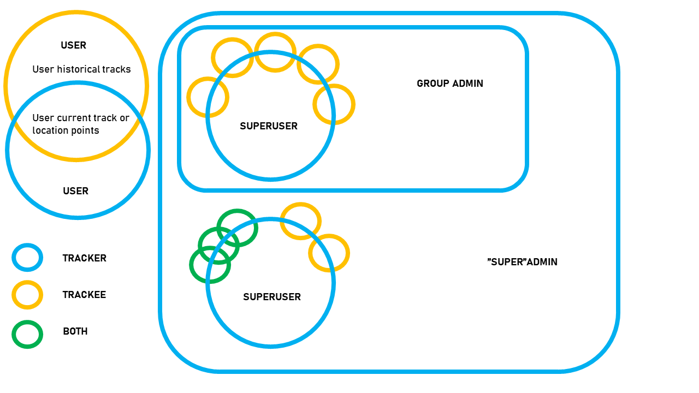

# User Level Planning
Berry Picker app is designed to prevent users from getting lost while berry picking or mushrooming. A simple one level user hierarchy is sufficient for tracking a user’s route, and giving current location. The user is able to see where they are and which direction they came from. However, it is possible to lose one’s way even if aware of one’s location, or the need for urgent help might arise for some other reason. To cover these situations, being able to share one’s location is a key functionality. Privacy, data security and retaining control of one’s own data are salient issues.
### Structures
* One user level, functionality for sending coordinates or current track to selected users or non-users, e.g. family members.
* One user level, current track sharing possible.
* Two user levels, user and superuser. Superuser can track users in a user group.
* Three user levels, user, superuser and admin. Admin has access to stored user data of user group or several user groups.

### Issues
- Data sharing must be easy to use and configure.
- The app stores device locations, whereby the database is a personal data register as defined by GDPR.
- Superuser tracking might enable app misuse for tracking employed berry pickers for reasons not related to the app’s original purpose.
### Solutions
Implementation 1.0
* One user level
* Limit number of trackees?
* Enable trackee mode
   * When help needed
   * Beforehand
* Give location within a radius (e.g.) 100 m as opposed to exact location?
  * Viability depends on terrain and accuracy of “exact” location

### Future versions
-	User groups
-	Finnish translation
